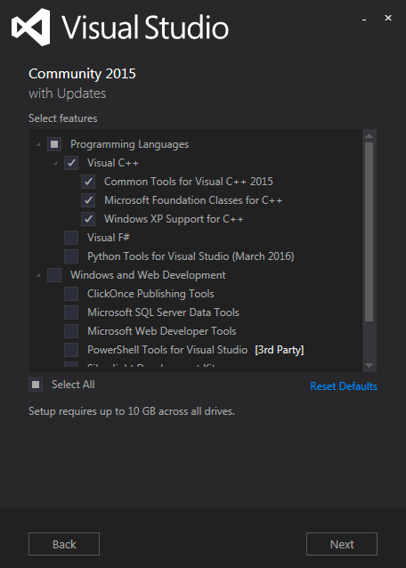
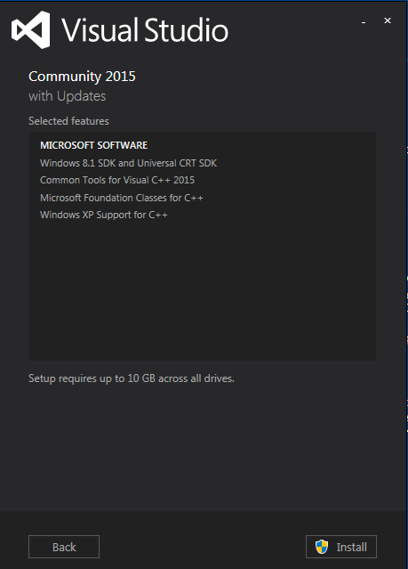

How to compile kibi native bindings
===================================

# Linux 

Use provided vagrant file.
You might want to edit node version and paths to bindings.

### For linux32 bit 

```
vagrant up ubuntu32
// check that the bindings are in native_bindings
// in case they are not ssh to the box 
vagrant ssh ubuntu32
// destroy the vm afterwards
vagrant destroy
```

### For linux64 bit 

```
vagrant up ubuntu64
// check that the bindings are in native_bindings
// in case they are not ssh to the box 
vagrant ssh ubuntu64
// destroy the vm afterwards
vagrant destroy
```


# Windows 

First meditate for some time and find your inner balance.
Once you feel you reach it do the following in a Windows VM.

Install nvm for Windows from https://github.com/coreybutler/nvm-windows/releases.

Install the node version set in `.node-version` for both 32 and 64 bit architectures, e.g:

```
nvm install 6.9.0 64
nvm install 6.9.0 32
```

Install Visual Studio Community 2015 and check C++ support during installation:




If you forgot to check it you need to install the following requirements:

- Windows Software Development Kit (SDK) for Windows 8.1 and 
- Visual C++ Compiler 

This can be done from Visual Studio in the following menu:

```
File -> New Project -> Visual C++ -> Install Visual C++ components
```

Install Python 2.7 from python.org.
Install Java JDK 8 (both 32 and 64 bit).

Install and enable node for the 64bit arch:

```
nvm use 6.9.0 64
```

Set the `JAVA_HOME` to the home of the 64 bit JDK, e.g.:

```
set JAVA_HOME="C:\Program Files\Java\jdk1.8.0_101"
```

Set build options:

```
npm config set python python2.7
npm config set msvs_version 2015 --global
```

Install node-gyp globally

```
npm install -g node-gyp
```

Create a temporary folder, then change into it and run the following commands:

```
npm install sqlite3@3.1.8
npm install jdbc@0.3.1
```

Copy `node_modules/jdbc/node_modules/java/build/Release/nodejavabridge_bindings.node` to `resources/nodejavabridges/windows64`.

Copy the directory `node_modules/sqlite3/lib/binding/node-v48-win32-x64` into `resources/nodesqlite3bindings/windows64`.

Install and enable node for the 32 bit arch:

```
nvm use 6.9.0 32
```

Set the `JAVA_HOME` to the home of the 32 bit JDK, e.g.:

```
set JAVA_HOME="C:\Program Files (x86)\Java\jdk1.8.0_101"
```

Set build options:

```
npm config set python python2.7
npm config set msvs_version 2015 --global
```

Install node-gyp globally

```
npm install -g node-gyp
```

Create a temporary folder, then change into it and run the following commands:

```
npm install sqlite3@3.1.8
npm install jdbc@0.3.1
```

Copy `node_modules/jdbc/node_modules/java/build/Release/nodejavabridge_bindings.node` to
`resources/nodejavabridges/windows-x86`

Copy the directory `node_modules/sqlite3/lib/binding/node-v46-win32-ia32` into
`resources/nodesqlite3bindings/windows-x86`.


Make a PR.
